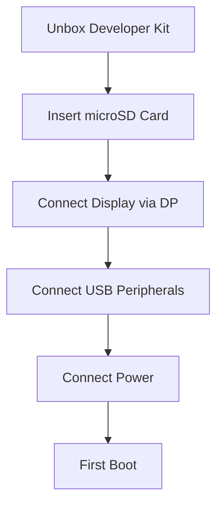
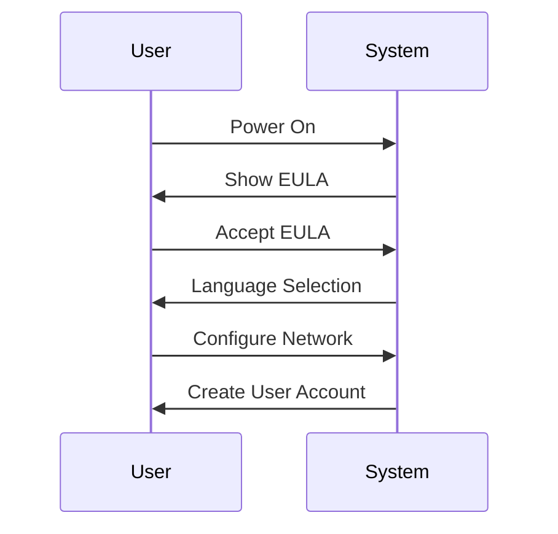
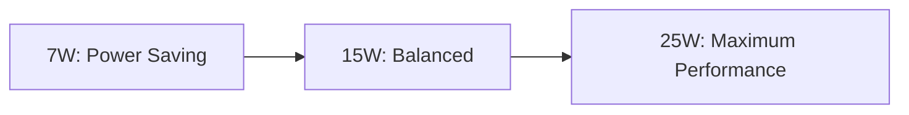

# Jetson Orin Nano Super Quick Start Guide

> Your comprehensive guide to getting started with NVIDIA's most affordable edge AI supercomputer

## 🚀 Quick Hardware Setup



## 📦 Kit Contents
- Jetson Orin Nano 8GB module with heatsink
- Reference carrier board
- Power supply 
- Wireless NIC
- Quick Start Guide

## 🛠️ Initial Setup Steps

### 1. Hardware Setup
- Insert microSD card (gold contacts facing heatsink)
- Connect DisplayPort to monitor
- Connect USB keyboard and mouse
- Connect power supply (verify green LED)

### 2. First Boot Configuration


### 3. Enable Maximum Performance
```bash
# Set MAXN power mode
sudo nvpmodel -m 0
sudo jetson_clocks
```

## 💻 Development Environment

### Basic Setup
```bash
# Update system
sudo apt update && sudo apt upgrade -y

# Install essentials
sudo apt install -y python3-pip git cmake
sudo apt install -y python3-tensorrt
```

### TensorRT-LLM Setup
```bash
# Clone TensorRT-LLM
git clone https://github.com/NVIDIA/TensorRT-LLM.git
cd TensorRT-LLM

# Build and install
python3 scripts/build_wheel.py --cuda_version 11.4
pip3 install ./build/tensorrt_llm*.whl
```

## 🎯 Your First AI Model

### Model Download & Optimization
```bash
# Get model
python3 scripts/download_model.py --model llama2-7b

# Optimize for TensorRT
python3 scripts/optimize_model.py \
    --model-path models/llama2-7b \
    --output-path models/llama2-7b-trt \
    --precision fp16
```

### Running Inference
```bash
# Test inference
python3 examples/inference.py \
    --model models/llama2-7b-trt \
    --input "What is edge computing?"
```

## 📊 System Monitoring

### Temperature & Performance
```bash
# Monitor system
tegrastats

# Watch temperatures
watch -n 2 cat /sys/devices/virtual/thermal/thermal_zone*/temp
```

## 🔍 Common Issues & Solutions

| Issue | Solution |
|-------|----------|
| System Throttling | Normal in MAXN mode, can disable notification |
| Poor Performance | Verify power mode, check thermal status |
| Memory Issues | Monitor with `tegrastats`, check process usage |

## 📈 Performance Modes



## 📚 Advanced Topics
- [Model Optimization Guide](docs/optimization.md)
- [Performance Tuning](docs/performance.md)
- [Computer Vision Setup](docs/vision.md)
- [Edge Deployment](docs/deployment.md)

## 🤝 Support
- Forums: [NVIDIA Developer Forums](https://forums.developer.nvidia.com/)
- Lab: [Jetson AI Lab](https://jetson.ai)
- Email: JetsonOrinNanoSuperSupport@NVIDIA.com

## 📝 Project Structure
```
jetson-orin-nano-super-guide/
├── docs/
│   ├── getting-started.md
│   ├── optimization.md
│   ├── performance.md
│   └── images/
├── examples/
│   ├── basic_inference.py
│   └── computer_vision.py
├── scripts/
│   ├── setup.sh
│   └── optimize_model.py
└── README.md
```

Would you like me to:
1. Add more technical details about specific features?
2. Create additional documentation sections?
3. Add more example code or scripts?
4. Include additional diagrams or visualizations?