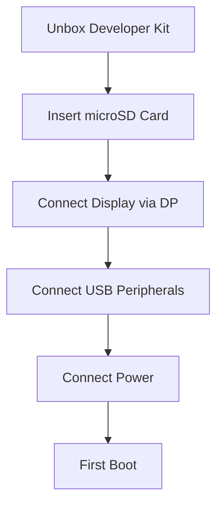
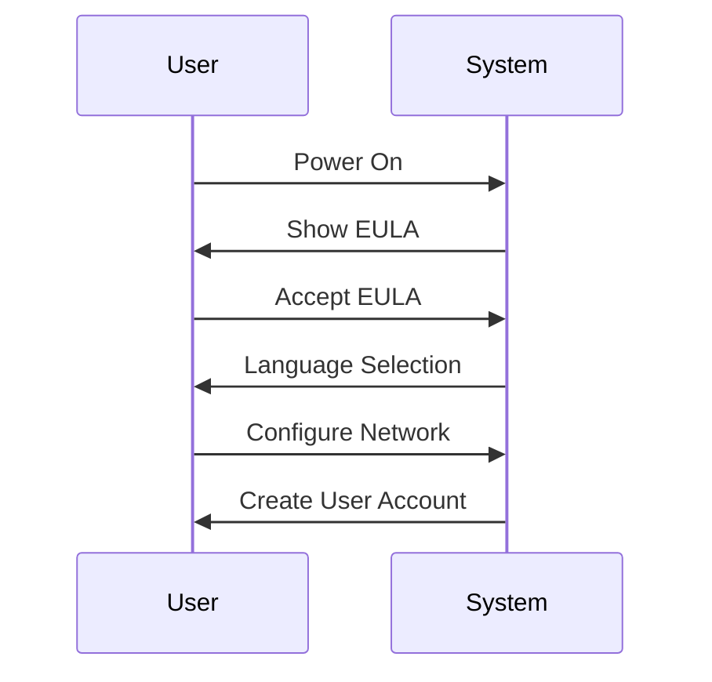

# Jetson Orin Nano Super Quick Start Guide


> Your comprehensive guide to getting started with NVIDIA's most affordable edge AI supercomputer

## 🚀 Quick Hardware Setup




## 📦 Kit Contents
- Jetson Orin Nano 8GB module with heatsink
- Reference carrier board
- Power supply
- Display Port
    - [HDMI cable is not supported.Click here to buy the Display Port](https://www.amazon.com/DisplayPort-Adapter-Compatible-ThinkPad-Desktop/dp/B07ZNNRYFL)
- Wireless NIC
- Quick Start Guide

## 🛠️ Initial Setup Steps

### 1. Hardware Setup
- Flash the SD card using Etcher on Windows, Linux or Mac system


> Ensure that you download the latest JetPack 6.2 SDK from [this link](https://developer.nvidia.com/downloads/embedded/l4t/r36_release_v4.3/jp62-orin-nano-sd-card-image.zip). Your Jetson Orin Nano Developer Kit comes with an old firmware flashed at the factory, which is NOT compatible with JetPack 6.x. Click here to download


- Insert microSD card (gold contacts facing heatsink)
- Connect DisplayPort to monitor

> Note: The NVIDIA Jetson Orin Nano Developer Kit doesn't support HDMI, but it does have a DisplayPort output port. You can use an adapter to connect the kit to a monitor or TV that only has HDMI. 

- Connect USB keyboard and mouse
- Connect power supply (verify green LED)

### 2. First Boot Configuration


### Note: NVIDIA Jetson Nano Orin Developer Kit can be upgraded to Jetson Orin Nano Super Developer Kit with a software update.

### 3. Enable Maximum Performance
```bash
# Set MAXN power mode
sudo nvpmodel -m 0
sudo jetson_clocks
```

## 💻 Development Environment

### Basic Setup
```bash
# Update system
sudo apt update && sudo apt upgrade -y

# Install essentials
sudo apt install -y python3-pip git cmake
sudo apt install -y python3-tensorrt
```

### TensorRT-LLM Setup
```bash
# Clone TensorRT-LLM
git clone https://github.com/NVIDIA/TensorRT-LLM.git
cd TensorRT-LLM

# Build and install
python3 scripts/build_wheel.py --cuda_version 12.6.0
pip3 install ./build/tensorrt_llm*.whl
```

The reason why we passed CUDA version 12.6.0. Reason - Based on your nvidia-smi output, we're using CUDA Version: 12.6
This is running on a Jetson Orin with driver version 540.4.0.

```
nvidia-smi
Tue Mar  4 09:42:45 2025
+---------------------------------------------------------------------------------------+
| NVIDIA-SMI 540.4.0                Driver Version: 540.4.0      CUDA Version: 12.6     |
|-----------------------------------------+----------------------+----------------------+
| GPU  Name                 Persistence-M | Bus-Id        Disp.A | Volatile Uncorr. ECC |
| Fan  Temp   Perf          Pwr:Usage/Cap |         Memory-Usage | GPU-Util  Compute M. |
|                                         |                      |               MIG M. |
|=========================================+======================+======================|
|   0  Orin (nvgpu)                  N/A  | N/A              N/A |                  N/A |
| N/A   N/A  N/A               N/A /  N/A | Not Supported        |     N/A          N/A |
|                                         |                      |                  N/A |
+-----------------------------------------+----------------------+----------------------+

+---------------------------------------------------------------------------------------+
| Processes:                                                                            |
|  GPU   GI   CI        PID   Type   Process name                            GPU Memory |
|        ID   ID                                                             Usage      |
|=======================================================================================|
|  No running processes found                                                           |
+---------------------------------------------------------------------------------------+
```


## 🎯 Your First AI Model

### Model Download & Optimization
```bash
# Get model
python3 scripts/download_model.py --model llama2-7b

# Optimize for TensorRT
python3 scripts/optimize_model.py \
    --model-path models/llama2-7b \
    --output-path models/llama2-7b-trt \
    --precision fp16
```

### Running Inference
```bash
# Test inference
python3 examples/inference.py \
    --model models/llama2-7b-trt \
    --input "What is edge computing?"
```

## 📊 System Monitoring

### Temperature & Performance
```bash
# Monitor system
tegrastats

# Watch temperatures
watch -n 2 cat /sys/devices/virtual/thermal/thermal_zone*/temp
```

## 🔍 Common Issues & Solutions

| Issue | Solution |
|-------|----------|
| System Throttling | Normal in MAXN mode, can disable notification |
| Poor Performance | Verify power mode, check thermal status |
| Memory Issues | Monitor with `tegrastats`, check process usage |

## 📈 Performance Modes


## 📚 Advanced Topics
- [Model Optimization Guide](docs/optimization.md) - WIP
- [Performance Tuning](docs/performance.md) - WIP
- [Computer Vision Setup](docs/vision.md) - WIP
- [Edge Deployment](docs/deployment.md) - WIP

## 🤝 Support
- Forums: [NVIDIA Developer Forums](https://forums.developer.nvidia.com/)
- Lab: [Jetson AI Lab](https://jetson.ai)


## 📝 Project Structure
```
jetson-orin-nano-super-guide/
├── docs/
│   ├── getting-started.md
│   ├── optimization.md
│   ├── performance.md
│   └── images/
├── examples/
│   ├── basic_inference.py
│   └── computer_vision.py
├── scripts/
│   ├── setup.sh
│   └── optimize_model.py
└── README.md
```


