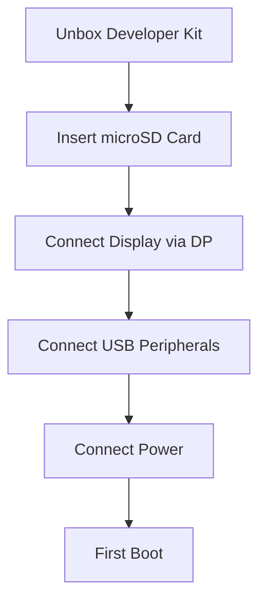
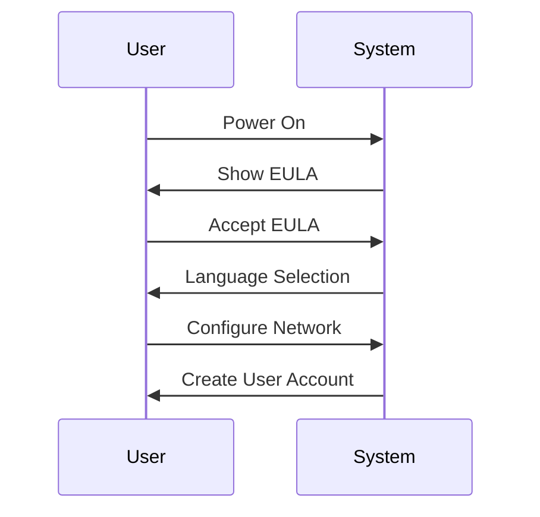

# Jetson Orin Nano Super Quick Start Guide


> Your comprehensive guide to getting started with NVIDIA's most affordable edge AI supercomputer

## 🚀 Quick Hardware Setup




## 📦 Kit Contents
- Jetson Orin Nano 8GB module with heatsink
- Reference carrier board
- Power supply
- Display Port
    - [HDMI cable is not supported.Click here to buy the Display Port](https://www.amazon.com/DisplayPort-Adapter-Compatible-ThinkPad-Desktop/dp/B07ZNNRYFL)
- Wireless NIC
- Quick Start Guide
- PCIE 3.0 NVMe M.2 SSD


## 🛠️ Initial Setup Steps

### 1. Hardware Setup
- Add NVMe SSD to the Jetson Board


- Flash the SD card using Etcher on Windows, Linux or Mac system


> Ensure that you download the latest JetPack 6.2 SDK from [this link](https://developer.nvidia.com/downloads/embedded/l4t/r36_release_v4.3/jp62-orin-nano-sd-card-image.zip). Your Jetson Orin Nano Developer Kit comes with an old firmware flashed at the factory, which is NOT compatible with JetPack 6.x. Click here to download


- Insert microSD card (gold contacts facing heatsink)
- Connect DisplayPort to monitor

> Note: The NVIDIA Jetson Orin Nano Developer Kit doesn't support HDMI, but it does have a DisplayPort output port. You can use an adapter to connect the kit to a monitor or TV that only has HDMI. 

- Connect USB keyboard and mouse
- Connect power supply (verify green LED)
- 

### 2. First Boot Configuration


### Note: NVIDIA Jetson Nano Orin Developer Kit can be upgraded to Jetson Orin Nano Super Developer Kit with a software update.

### 3. Enable Maximum Performance
```bash
# Set MAXN power mode
sudo nvpmodel -m 0
sudo jetson_clocks
```

## 💻 Development Environment

### Basic Setup
```bash
# Update system
sudo apt update && sudo apt upgrade -y

# Install essentials
sudo apt install -y python3-pip git cmake
sudo apt install -y python3-tensorrt
```

## TensorRT-LLM Setup


### Installing all the Prerequisites

```
sudo apt-get update
sudo apt-get install -y python3-pip libopenblas-dev git-lfs ccache
wget https://raw.githubusercontent.com/pytorch/pytorch/9b424aac1d70f360479dd919d6b7933b5a9181ac/.ci/docker/common/install_cusparselt.sh
export CUDA_VERSION=12.6
sudo -E bash ./install_cusparselt.sh
python3 -m pip install numpy=='1.26.1'
```

## Result:

```
Defaulting to user installation because normal site-packages is not writeable
Collecting numpy==1.26.1
  Downloading numpy-1.26.1-cp310-cp310-manylinux_2_17_aarch64.manylinux2014_aarch64.whl (14.2 MB)
     ━━━━━━━━━━━━━━━━━━━━━━━━━━━━━━━━━━━━━━━━ 14.2/14.2 MB 4.9 MB/s eta 0:00:00
Installing collected packages: numpy
  WARNING: The script f2py is installed in '/home/ajeetraina/.local/bin' which is not on PATH.
  Consider adding this directory to PATH or, if you prefer to suppress this warning, use --no-warn-script-location.
Successfully installed numpy-1.26.1
```

## Setting up TensorRT LLM

```bash
# Clone TensorRT-LLM
git clone https://github.com/NVIDIA/TensorRT-LLM.git
cd TensorRT-LLM
git checkout v0.12.0-jetson
git lfs pull
```

```
python3 scripts/build_wheel.py --clean --cuda_architectures 87 -DENABLE_MULTI_DEVICE=0 --build_type Release --benchmarks --use_ccache
-- The CXX compiler identification is GNU 11.4.0
-- Detecting CXX compiler ABI info
-- Detecting CXX compiler ABI info - done
-- Check for working CXX compiler: /usr/bin/c++ - skipped
-- Detecting CXX compile features
-- Detecting CXX compile features - done
-- NVTX is disabled
-- Importing batch manager
-- Importing executor
-- Importing nvrtc wrapper
-- Building PyTorch
-- Building Google tests
-- Building benchmarks
-- Not building C++ micro benchmarks
-- TensorRT-LLM version: 0.12.0
-- Looking for a CUDA compiler
-- Looking for a CUDA compiler - /usr/local/cuda-12.6/bin/nvcc
-- CUDA compiler: /usr/local/cuda-12.6/bin/nvcc
-- GPU architectures: 87
-- The C compiler identification is GNU 11.4.0
-- The CUDA compiler identification is NVIDIA 12.6.68
-- Detecting C compiler ABI info
-- Detecting C compiler ABI info - done
-- Check for working C compiler: /usr/bin/cc - skipped
-- Detecting C compile features
-- Detecting C compile features - done
-- Detecting CUDA compiler ABI info
-- Detecting CUDA compiler ABI info - done
-- Check for working CUDA compiler: /usr/local/cuda-12.6/bin/nvcc - skipped
-- Detecting CUDA compile features
-- Detecting CUDA compile features - done
-- Found CUDAToolkit: /usr/local/cuda-12.6/include (found version "12.6.68")
-- Looking for pthread.h
-- Looking for pthread.h - found
-- Performing Test CMAKE_HAVE_LIBC_PTHREAD
-- Performing Test CMAKE_HAVE_LIBC_PTHREAD - Success
-- Found Threads: TRUE
-- CUDA library status:
--     version: 12.6.68
--     libraries: /usr/local/cuda-12.6/lib64
--     include path: /usr/local/cuda-12.6/targets/aarch64-linux/include
-- ========================= Importing and creating target nvinfer ==========================
-- Looking for library nvinfer
-- Library that was found /usr/lib/aarch64-linux-gnu/libnvinfer.so
-- ==========================================================================================
-- CUDAToolkit_VERSION 12.6 is greater or equal than 11.0, enable -DENABLE_BF16 flag
-- CUDAToolkit_VERSION 12.6 is greater or equal than 11.8, enable -DENABLE_FP8 flag
-- COMMON_HEADER_DIRS: /home/ajeetraina/TensorRT-LLM/cpp;/usr/local/cuda-12.6/include
-- Found Python3: /usr/bin/python3.10 (found version "3.10.12") found components: Interpreter Development Development.Module Development.Embed
-- USE_CXX11_ABI is set by python Torch to 1
-- TORCH_CUDA_ARCH_LIST: 8.7+PTX
-- Found Python executable at /usr/bin/python3.10
-- Found Python libraries at /usr/lib/aarch64-linux-gnu
...
...
```

```
pip install build/tensorrt_llm-*.whl
```


Since I'm building on a Jetson Orin with CUDA 12.6, the script should automatically detect and use the correct CUDA installation. 
The build might take some time as TensorRT-LLM is a complex library with many components.

```
nvidia-smi
Tue Mar  4 09:42:45 2025
+---------------------------------------------------------------------------------------+
| NVIDIA-SMI 540.4.0                Driver Version: 540.4.0      CUDA Version: 12.6     |
|-----------------------------------------+----------------------+----------------------+
| GPU  Name                 Persistence-M | Bus-Id        Disp.A | Volatile Uncorr. ECC |
| Fan  Temp   Perf          Pwr:Usage/Cap |         Memory-Usage | GPU-Util  Compute M. |
|                                         |                      |               MIG M. |
|=========================================+======================+======================|
|   0  Orin (nvgpu)                  N/A  | N/A              N/A |                  N/A |
| N/A   N/A  N/A               N/A /  N/A | Not Supported        |     N/A          N/A |
|                                         |                      |                  N/A |
+-----------------------------------------+----------------------+----------------------+

+---------------------------------------------------------------------------------------+
| Processes:                                                                            |
|  GPU   GI   CI        PID   Type   Process name                            GPU Memory |
|        ID   ID                                                             Usage      |
|=======================================================================================|
|  No running processes found                                                           |
+---------------------------------------------------------------------------------------+
```

```
 Downloading accelerate-1.4.0-py3-none-any.whl (342 kB)
     ━━━━━━━━━━━━━━━━━━━━━━━━━━━━━━━━━━━━━━━━ 342.1/342.1 KB 1.9 MB/s eta 0:00:00
Collecting build
  Downloading build-1.2.2.post1-py3-none-any.whl (22 kB)
Collecting colored
  Downloading colored-2.3.0-py3-none-any.whl (18 kB)
Collecting cuda-python
  Downloading cuda_python-12.8.0-py3-none-any.whl (11 kB)
Collecting diffusers>=0.27.0
  Downloading diffusers-0.32.2-py3-none-any.whl (3.2 MB)
     ━━━━━━━━━━━━━━━━━━━━━━━━━━━━━━━━━━━━━━━━ 3.2/3.2 MB 4.6 MB/s eta 0:00:00
Collecting lark
  Downloading lark-1.2.2-py3-none-any.whl (111 kB)
     ━━━━━━━━━━━━━━━━━━━━━━━━━━━━━━━━━━━━━━━━ 111.0/111.0 KB 14.2 MB/s eta 0:00:00
Collecting mpi4py
  Downloading mpi4py-4.0.3.tar.gz (466 kB)
     ━━━━━━━━━━━━━━━━━━━━━━━━━━━━━━━━━━━━━━━━ 466.3/466.3 KB 6.6 MB/s eta 0:00:00
  Installing build dependencies ... done
  Getting requirements to build wheel ... done
  Installing backend dependencies ... done
  Preparing metadata (pyproject.toml) ... done
Requirement already satisfied: numpy<2 in /usr/lib/python3/dist-packages (from -r requirements.txt (line 8)) (1.21.5)
Collecting onnx>=1.12.0
  Downloading onnx-1.17.0-cp310-cp310-manylinux_2_17_aarch64.manylinux2014_aarch64.whl (15.9 MB)
     ━━━━━━━━━━━━━━━━━━━━━━━━━━━━━━━━━━━━━━━━ 15.9/15.9 MB 7.4 MB/s eta 0:00:00
Collecting onnx_graphsurgeon>=0.5.2
  Downloading onnx_graphsurgeon-0.5.5-py2.py3-none-any.whl (57 kB)
     ━━━━━━━━━━━━━━━━━━━━━━━━━━━━━━━━━━━━━━━━ 57.8/57.8 KB 7.8 MB/s eta 0:00:00
Collecting openai
  Downloading openai-1.65.2-py3-none-any.whl (473 kB)
     ━━━━━━━━━━━━━━━━━━━━━━━━━━━━━━━━━━━━━━━━ 473.2/473.2 KB 9.0 MB/s eta 0:00:00
Collecting polygraphy
  Downloading polygraphy-0.49.18-py2.py3-none-any.whl (354 kB)
     ━━━━━━━━━━━━━━━━━━━━━━━━━━━━━━━━━━━━━━━━ 354.7/354.7 KB 8.2 MB/s eta 0:00:00
Collecting psutil
  Downloading psutil-7.0.0-cp36-abi3-manylinux_2_17_aarch64.manylinux2014_aarch64.whl (279 kB)
     ━━━━━━━━━━━━━━━━━━━━━━━━━━━━━━━━━━━━━━━━ 279.5/279.5 KB 11.7 MB/s eta 0:00:00
Collecting pynvml>=11.5.0
  Downloading pynvml-12.0.0-py3-none-any.whl (26 kB)
Collecting pulp
  Downloading PuLP-3.0.2-py3-none-any.whl (17.7 MB)
     ━━━━━━━━━━━━━━━━━━━━━━━━━━━━━━━━━━━━━━━━ 17.7/17.7 MB 9.3 MB/s eta 0:00:00
Requirement already satisfied: pandas in /usr/lib/python3/dist-packages (from -r requirements.txt (line 16)) (1.3.5)
Collecting h5py==3.12.1
  Downloading h5py-3.12.1-cp310-cp310-manylinux_2_17_aarch64.manylinux2014_aarch64.whl (5.2 MB)
     ━━━━━━━━━━━━━━━━━━━━━━━━━━━━━━━━━━━━━━━━ 5.2/5.2 MB 9.8 MB/s eta 0:00:00
Collecting StrEnum
  Downloading StrEnum-0.4.15-py3-none-any.whl (8.9 kB)
Collecting sentencepiece>=0.1.99
  Downloading sentencepiece-0.2.0-cp310-cp310-manylinux_2_17_aarch64.manylinux2014_aarch64.whl (1.3 MB)
     ━━━━━━━━━━━━━━━━━━━━━━━━━━━━━━━━━━━━━━━━ 1.3/1.3 MB 10.0 MB/s eta 0:00:00
Collecting tensorrt~=10.8.0
  Downloading tensorrt-10.8.0.43.tar.gz (35 kB)
  Preparing metadata (setup.py) ... done
Collecting torch<=2.6.0,>=2.6.0a0
  Downloading torch-2.6.0-cp310-cp310-manylinux_2_28_aarch64.whl (95.8 MB)
     ━━━━━━━━━━━━━━━━━━━━━━━━━━━━━━━━━━━━━━━━ 95.8/95.8 MB 6.2 MB/s eta 0:00:00
Collecting torchvision
  Downloading torchvision-0.21.0-cp310-cp310-manylinux_2_28_aarch64.whl (14.7 MB)
     ━━━━━━━━━━━━━━━━━━━━━━━━━━━━━━━━━━━━━━━━ 14.7/14.7 MB 8.7 MB/s eta 0:00:00
Collecting nvidia-modelopt[torch]~=0.23.0
  Downloading nvidia_modelopt-0.23.2-py3-none-manylinux_2_28_aarch64.whl (602 kB)
     ━━━━━━━━━━━━━━━━━━━━━━━━━━━━━━━━━━━━━━━━ 602.7/602.7 KB 3.8 MB/s eta 0:00:00
Collecting nvidia-nccl-cu12
  Downloading nvidia_nccl_cu12-2.25.1-py3-none-manylinux2014_aarch64.manylinux_2_17_aarch64.whl (201.6 MB)
     ━━━━━━━━━━━━╺━━━━━━━━━━━━━━━━━━━━━━━━━━━ 61.9/201.6 MB 3.6 MB/s eta 0:00:39
```


## 🎯 Your First AI Model

### Model Download & Optimization
```bash
# Get model
python3 scripts/download_model.py --model llama2-7b

# Optimize for TensorRT
python3 scripts/optimize_model.py \
    --model-path models/llama2-7b \
    --output-path models/llama2-7b-trt \
    --precision fp16
```

### Running Inference
```bash
# Test inference
python3 examples/inference.py \
    --model models/llama2-7b-trt \
    --input "What is edge computing?"
```

## 📊 System Monitoring

### Temperature & Performance
```bash
# Monitor system
tegrastats

# Watch temperatures
watch -n 2 cat /sys/devices/virtual/thermal/thermal_zone*/temp
```

## 🔍 Common Issues & Solutions

| Issue | Solution |
|-------|----------|
| System Throttling | Normal in MAXN mode, can disable notification |
| Poor Performance | Verify power mode, check thermal status |
| Memory Issues | Monitor with `tegrastats`, check process usage |

## 📈 Performance Modes


## 📚 Advanced Topics
- [Model Optimization Guide](docs/optimization.md) - WIP
- [Performance Tuning](docs/performance.md) - WIP
- [Computer Vision Setup](docs/vision.md) - WIP
- [Edge Deployment](docs/deployment.md) - WIP

## 🤝 Support
- Forums: [NVIDIA Developer Forums](https://forums.developer.nvidia.com/)
- Lab: [Jetson AI Lab](https://jetson.ai)


## 📝 Project Structure
```
jetson-orin-nano-super-guide/
├── docs/
│   ├── getting-started.md
│   ├── optimization.md
│   ├── performance.md
│   └── images/
├── examples/
│   ├── basic_inference.py
│   └── computer_vision.py
├── scripts/
│   ├── setup.sh
│   └── optimize_model.py
└── README.md
```

## Using  BME680 Sensor with Jetson Orin


```
 sudo i2cdetect -y -r 7
     0  1  2  3  4  5  6  7  8  9  a  b  c  d  e  f
00:                         08 -- -- -- -- -- -- --
10: -- -- -- -- -- -- -- -- -- -- -- -- -- -- -- --
20: -- -- -- -- -- -- -- -- -- -- -- -- -- -- -- --
30: -- -- -- -- -- -- -- -- -- -- -- -- -- -- -- --
40: -- -- -- -- -- -- -- -- -- -- -- -- -- -- -- --
50: -- -- -- -- -- -- -- -- -- -- -- -- -- -- -- --
60: -- -- -- -- -- -- -- -- -- -- -- -- -- -- -- --
70: -- -- -- -- -- -- 76 --
```


