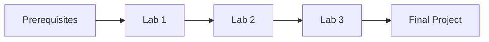

# Jetson Orin Nano Super Workshop

> A comprehensive hands-on workshop for the most affordable Edge AI Supercomputer

## Workshop Overview

This workshop guides you through setting up, optimizing, and developing AI applications on the NVIDIA Jetson Orin Nano Super Developer Kit.

## Workshop Structure

### Lab 1: Basic Setup & Configuration
- Initial hardware setup
- Software installation
- Power mode configuration
- Performance verification

### Lab 2: AI Model Optimization
- Model selection and preparation
- TensorRT-LLM optimization
- Performance benchmarking
- Deployment strategies

### Lab 3: Sensor Integration
- BME680 sensor setup
- Real-time data collection
- AI model integration
- End-to-end application development

## Prerequisites

### Hardware Requirements
- NVIDIA Jetson Orin Nano Super Developer Kit
- BME680 sensor
- Display with DisplayPort/HDMI
- USB keyboard and mouse

### Software Requirements
- Basic Linux/Ubuntu knowledge
- Python programming experience
- Git familiarity

## Getting Started

## Time Commitment

- Lab 1: 2 hours
- Lab 2: 3 hours
- Lab 3: 3 hours
- Total: 8 hours

## Support

For issues or questions:
- GitHub Issues
- Email Support: JetsonOrinNanoSuperSupport@NVIDIA.com
