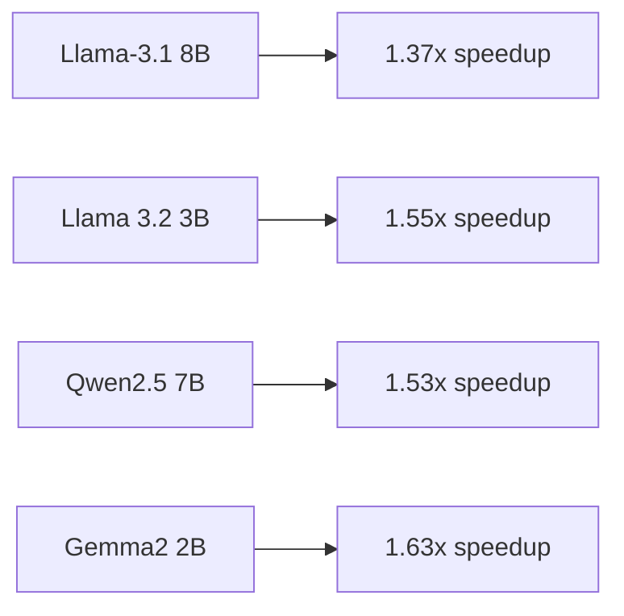

# Model Selection

## Available Models

### Large Language Models (LLMs)


### Vision Language Models (VLMs)
- VILA 1.5 3B: 1.51x improvement
- InternVL2.5 4B: 2.04x improvement
- PaliGemma2 3B: 1.58x improvement

## Selection Criteria

### Memory Constraints
```python
def check_memory_requirements(model_size_b):
    """Check if model fits in memory"""
    memory_gb = model_size_b * 4  # Approximate memory usage
    available_memory = 8  # Jetson Orin Nano Super has 8GB
    
    return memory_gb <= available_memory * 0.8  # Keep 20% buffer
```

### Performance Requirements
- Inference time < 100ms
- Memory usage < 6GB
- Batch size support

## Model Downloads

### HuggingFace Models
```bash
# Download Llama 3.2 3B
python3 scripts/download.py \
    --model-name llama-3.2-3b \
    --output-dir models/

# Download Gemma 2B
python3 scripts/download.py \
    --model-name gemma-2b \
    --output-dir models/
```

### Custom Model Format
```python
def convert_to_tensorrt(model_path):
    """Convert HuggingFace model to TensorRT format"""
    import torch
    from transformers import AutoModel
    
    # Load model
    model = AutoModel.from_pretrained(model_path)
    
    # Export to ONNX
    torch.onnx.export(model, ...)
    
    # Convert to TensorRT
    # Implementation details
```

## Model Verification

### Basic Testing
```python
from transformers import pipeline

def test_model(model_name):
    pipe = pipeline("text-generation", model=model_name)
    result = pipe("Hello, how are you?", max_length=50)
    print(result)
```

### Memory Usage Check
```python
import psutil
import torch

def check_memory_usage(model):
    torch.cuda.reset_peak_memory_stats()
    
    # Run inference
    output = model("Test input")
    
    max_memory = torch.cuda.max_memory_allocated()
    print(f"Peak memory usage: {max_memory / 1e9:.2f} GB")
```

## Next Steps

Proceed to [TensorRT Optimization](tensorrt-optimization.md)
