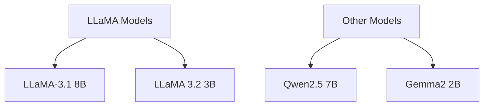

# Model Selection

## Available Models

### Large Language Models (LLMs)



### Vision Language Models (VLMs)

| Model | Parameters | Input | Memory |
|-------|------------|-------|--------|
| VILA 1.5 3B | 3B | Image+Text | 4GB |
| LLAVA 1.6 7B | 7B | Image+Text | 7GB |
| SmoLVLM-2B | 2B | Image+Text | 3GB |

## Model Requirements

### Memory Considerations
```python
def estimate_memory(model_size_b, precision='fp16'):
    base_memory = model_size_b * (2 if precision == 'fp16' else 1)
    overhead = base_memory * 0.2  # 20% overhead
    return base_memory + overhead
```

### Compute Requirements

| Model Size | Min Power Mode | Recommended Mode |
|------------|---------------|------------------|
| < 3B       | 7W            | 15W             |
| 3B - 7B    | 15W           | 25W             |
| > 7B       | 25W           | 25W             |

## Downloading Models

### Using Hugging Face
```bash
# Install transformers
pip install transformers

# Download model
python -c "
 from transformers import AutoModel
 model = AutoModel.from_pretrained('meta-llama/Llama-3.2-3B')
 model.save_pretrained('./models/llama-3b')
"
```

### Direct Download
```bash
# Create models directory
mkdir -p models && cd models

# Download model files
wget https://huggingface.co/meta-llama/Llama-3.2-3B/resolve/main/model.safetensors
```

## Model Verification

### Check Model Files
```bash
# List model files
ls -lh models/llama-3b/

# Verify checksums
sha256sum models/llama-3b/* > checksums.txt
```

### Basic Inference Test
```python
from transformers import AutoModelForCausalLM, AutoTokenizer

def test_model(model_path):
    # Load model and tokenizer
    model = AutoModelForCausalLM.from_pretrained(model_path)
    tokenizer = AutoTokenizer.from_pretrained(model_path)
    
    # Test inference
    input_text = "Hello, world!"
    inputs = tokenizer(input_text, return_tensors="pt")
    outputs = model.generate(**inputs, max_length=50)
    
    return tokenizer.decode(outputs[0])
```

## Next Steps

Proceed to [TensorRT Optimization](tensorrt-optimization.md)
