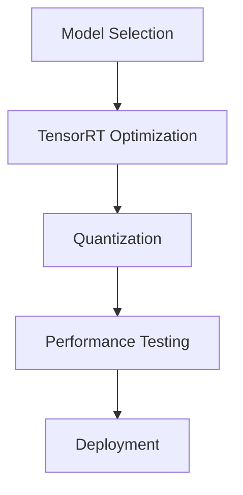

# Lab 2: AI Model Optimization

## Overview

In this lab, you'll learn how to optimize AI models for the Jetson Orin Nano Super using TensorRT-LLM.

## Learning Objectives

- Understand TensorRT-LLM optimization techniques
- Implement model quantization (FP16 and INT8)
- Measure and compare model performance
- Deploy optimized models

## Time Estimate

- Model Selection: 30 minutes
- Optimization: 1 hour
- Testing: 1 hour
- Deployment: 30 minutes
- Total: 3 hours

## Prerequisites

### From Lab 1
- Completed basic setup
- System in MAXN (25W) mode
- Development environment ready

### Additional Requirements
- 10GB free storage
- Basic understanding of ML models
- Python experience

## Lab Structure

## Performance Targets

| Model Type | Original Latency | Optimized Target |
|------------|------------------|------------------|
| LLM (3B)   | ~500ms/token    | ~100ms/token    |
| VLM        | ~2000ms         | ~500ms          |
| ViT        | ~100ms          | ~30ms           |

## What You'll Learn

### Optimization Techniques
- Model quantization (FP16/INT8)
- Tensor parallelism
- Kernel auto-tuning
- Memory optimization

### Performance Analysis
- Latency measurement
- Memory usage profiling
- Throughput optimization
- Temperature monitoring

## Lab Modules

1. [Model Selection](model-selection.md)
2. [TensorRT Optimization](tensorrt-optimization.md)
3. [Performance Testing](performance-testing.md)
