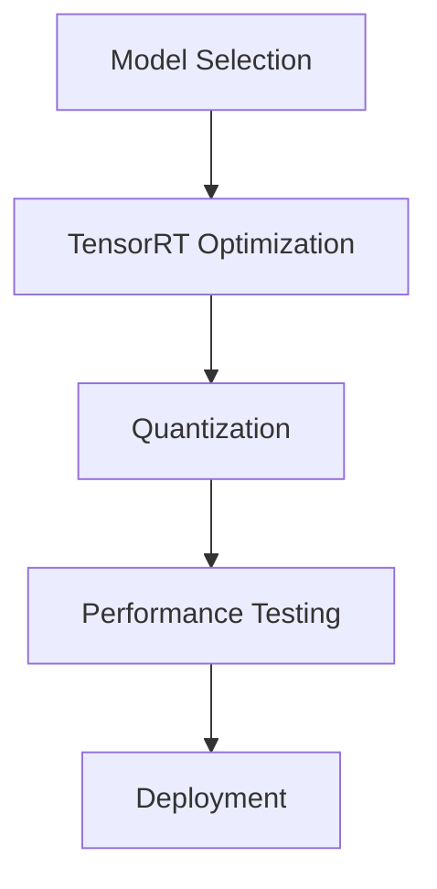

# Lab 2: AI Model Optimization

## Overview

This lab focuses on optimizing AI models for the Jetson Orin Nano Super using TensorRT-LLM. You'll learn how to optimize, quantize, and deploy models efficiently.

## Learning Objectives

- Understand TensorRT-LLM optimization techniques
- Implement FP16 and INT8 quantization
- Benchmark model performance
- Deploy optimized models

## Lab Structure



## Time Estimate
- Model Selection: 30 minutes
- Optimization: 1 hour
- Testing: 1 hour
- Deployment: 30 minutes

## Prerequisites

### Software Requirements
```bash
# Install TensorRT-LLM
git clone https://github.com/NVIDIA/TensorRT-LLM.git
cd TensorRT-LLM
python3 scripts/build_wheel.py --cuda_version 11.4

# Install additional dependencies
pip install torch numpy transformers
```

## Performance Targets

| Model Size | Original Latency | Optimized Latency | Memory Usage |
|------------|------------------|-------------------|---------------|
| < 3B params | 500ms | 100ms | 2GB |
| 3-7B params | 1000ms | 200ms | 4GB |
| 7-13B params | 2000ms | 400ms | 6GB |

## Tools Used
- TensorRT-LLM
- NVIDIA Nsight Systems
- Python profiling tools
- Custom benchmarking scripts

## Lab Modules
1. [Model Selection](model-selection.md)
2. [TensorRT Optimization](tensorrt-optimization.md)
3. [Performance Testing](performance-testing.md)
