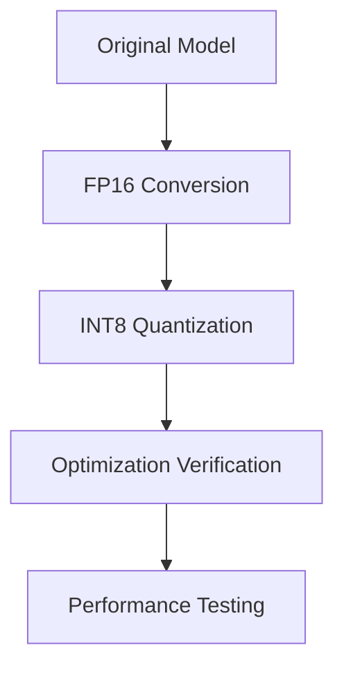

# TensorRT Optimization

## Optimization Process



## FP16 Optimization

### Basic FP16 Conversion
```python
from tensorrt_llm.builder import Builder

def optimize_fp16(model_path, output_path):
    builder = Builder()
    builder.fp16_mode = True
    builder.max_workspace_size = 8 * 1024 * 1024 * 1024  # 8GB
    
    engine = builder.build_engine(
        model_path,
        output_path
    )
    return engine
```

### Advanced Configuration
```python
def configure_builder(builder):
    config = builder.create_builder_config()
    config.set_flag(trt.BuilderFlag.FP16)
    
    # Set other optimizations
    config.set_memory_pool_limit(
        trt.MemoryPoolType.WORKSPACE, 8 * 1024 * 1024 * 1024
    )
    
    return config
```

## INT8 Quantization

### Calibration Data Generation
```python
def generate_calibration_data(dataset_path, num_samples=1000):
    """Generate calibration data for INT8 quantization"""
    import numpy as np
    
    # Load dataset
    data = load_dataset(dataset_path)
    
    # Sample data
    indices = np.random.choice(
        len(data),
        num_samples,
        replace=False
    )
    
    return [data[i] for i in indices]
```

### INT8 Optimization
```python
def optimize_int8(model_path, output_path, calibration_data):
    builder = Builder()
    builder.int8_mode = True
    builder.int8_calibrator = calibrator
    
    # Set calibration data
    calibrator.set_batch_stream(calibration_data)
    
    engine = builder.build_engine(
        model_path,
        output_path
    )
    return engine
```

## Memory Optimization

### Workspace Management
```python
def optimize_memory(builder):
    # Set workspace size
    builder.max_workspace_size = 4 * 1024 * 1024 * 1024  # 4GB
    
    # Enable attention caching
    builder.attention_cache_size = 1024
    
    # Set maximum batch size
    builder.max_batch_size = 1
```

### Layer Optimization
```python
def optimize_layers(network):
    # Fuse layers where possible
    network.enable_layer_fusion()
    
    # Optimize tensor layouts
    network.optimize_tensor_layouts()
```

## Optimization Verification

### Basic Testing
```python
def verify_optimization(engine_path):
    # Load engine
    with open(engine_path, 'rb') as f:
        engine_str = f.read()
    
    # Create context
    context = runtime.deserialize_cuda_engine(engine_str)
    
    # Run inference
    inputs = prepare_input("Test input")
    outputs = run_inference(context, inputs)
    
    return outputs
```

### Performance Comparison
```python
def compare_performance(original_model, optimized_model):
    results = {
        'original': benchmark_model(original_model),
        'optimized': benchmark_model(optimized_model)
    }
    
    print("Performance Comparison:")
    for model, metrics in results.items():
        print(f"{model}:")
        print(f"  Latency: {metrics['latency']:.2f}ms")
        print(f"  Memory: {metrics['memory']:.2f}GB")
```

## Next Steps

Proceed to [Performance Testing](performance-testing.md)
