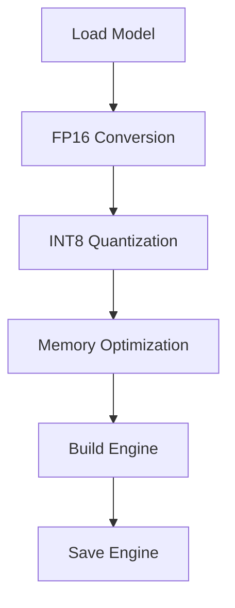

# TensorRT Optimization

## Setup TensorRT-LLM

### Installation
```bash
# Clone TensorRT-LLM
git clone https://github.com/NVIDIA/TensorRT-LLM.git
cd TensorRT-LLM

# Install requirements
pip install -r requirements.txt

# Build TensorRT-LLM
python scripts/build_wheel.py --cuda_version 11.4
pip install build/tensorrt_llm*.whl
```

## FP16 Optimization

### Basic Optimization
```python
from tensorrt_llm.builder import Builder

def optimize_fp16(model_path, output_path):
    builder = Builder()
    builder.fp16_mode = True
    builder.max_workspace_size = 8 * 1024 * 1024 * 1024  # 8GB
    
    return builder.build_engine(model_path, output_path)
```

### Advanced Configuration
```python
from tensorrt_llm.network import Network

def optimize_advanced(model_path):
    network = Network()
    network.enable_fp16 = True
    network.enable_strict_types = True
    
    # Configure layers
    network.layer_precision = {
        'attention': 'fp16',
        'mlp': 'fp16',
        'layernorm': 'fp32'  # Keep LayerNorm in FP32
    }
    
    return network
```

## INT8 Quantization

### Calibration Data
```python
def prepare_calibration_data():
    # Generate or load calibration data
    calib_data = [
        "Sample text for calibration.",
        "Another calibration example.",
        # Add more calibration samples
    ]
    return calib_data
```

### INT8 Optimization
```python
def optimize_int8(model_path, calib_data):
    builder = Builder()
    builder.int8_mode = True
    builder.int8_calibrator = Calibrator(calib_data)
    
    return builder.build_engine(model_path)
```

## Memory Optimization

### Attention Caching
```python
def configure_memory():
    config = {
        'max_batch_size': 1,
        'max_input_len': 512,
        'max_output_len': 128,
        'enable_attention_caching': True,
        'attention_cache_size': 1024
    }
    return config
```

### Workspace Management
```python
def optimize_workspace():
    builder = Builder()
    # 4GB workspace
    builder.max_workspace_size = 4 * 1024 * 1024 * 1024
    return builder
```

## Complete Optimization Pipeline



## Performance Monitoring

### Memory Usage
```python
def monitor_memory():
    import torch
    print(f"GPU Memory: {torch.cuda.memory_allocated()/1e9:.2f}GB")
```

### Temperature Check
```bash
tegrastats --interval 1000
```

## Next Steps

Proceed to [Performance Testing](performance-testing.md)
